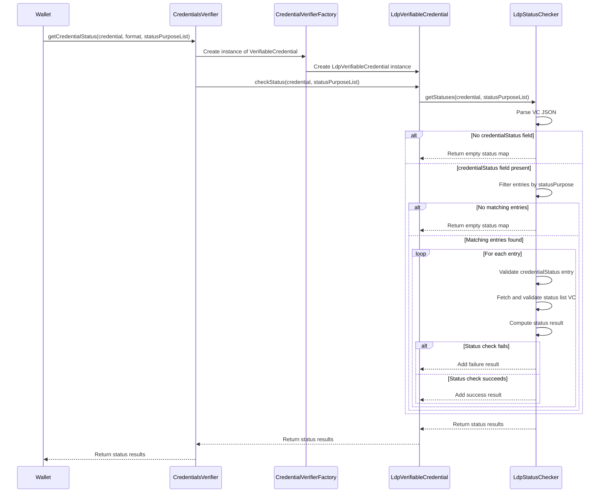

## Support for Credential Status during verification of Verifiable Credential

This document provides a comprehensive overview to check credentual status for a Verifiable Credential (VC) as per 
[W3C StatusList2021 specification](https://www.w3.org/TR/vc-bitstring-status-list/#bitstringstatuslistentry).

### Supported Credential Formats
- Credential status is supported only for `ldp_vc` credential format.

### Steps Involved
1. Verify the credential as per existing process for the specific credential format.
2. Check the credential status as per W3C StatusList2021 specification.
   - If the credential format is `ldp_vc`, follow the steps mentioned below to check the credential status.
     - Fetch the status list credential from the `credentialStatus` property of the VC.
     - Validate and Verify the status list credential.
     - Decode the bitstring from the status list credential.
     - Check the bit at the index specified in the `statusListIndex` property of the VC.
     - If the bit is set to 0, the credential is valid. If it is more than 0 the credential is not valid.
   - For other credential formats, throw `UnsupportedOperationException`.

###  Sequence diagram - To check credential status for `ldp_vc` credential format VC

